# Hi, I'm Sergey! 👋

## 🚀 About Me

💻 I'm a full stack web-developer currently working at Aimed Global. 

⌛ Contributing to open-source projects and creating pet-projects in my spare time.

🌍 Currently residing at Novi Sad, Serbia

㊗️ Speaking Russian, English and a bit of Serbian
## 🛠 Skills

## 🔗 Links

## Github Stats

